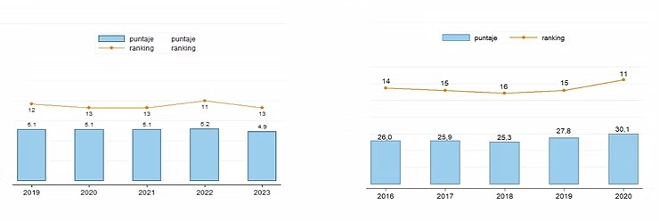
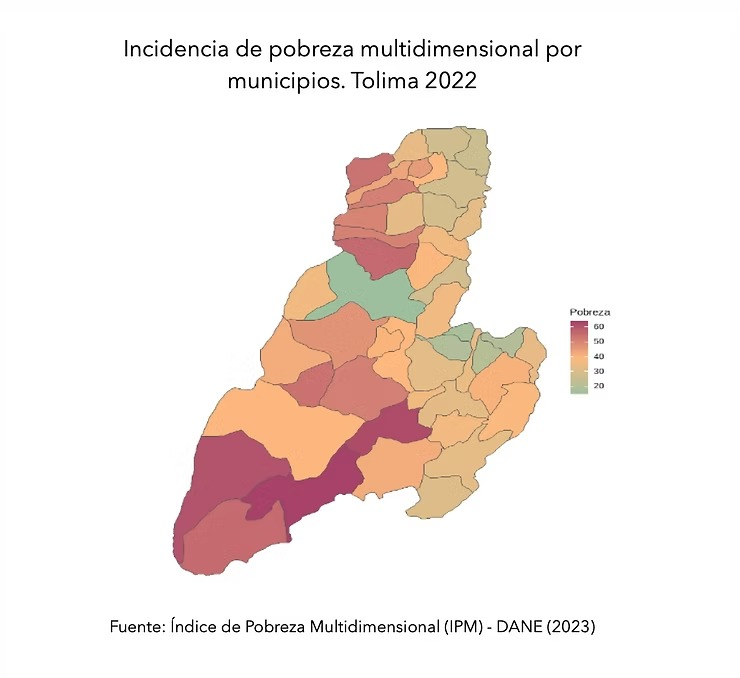
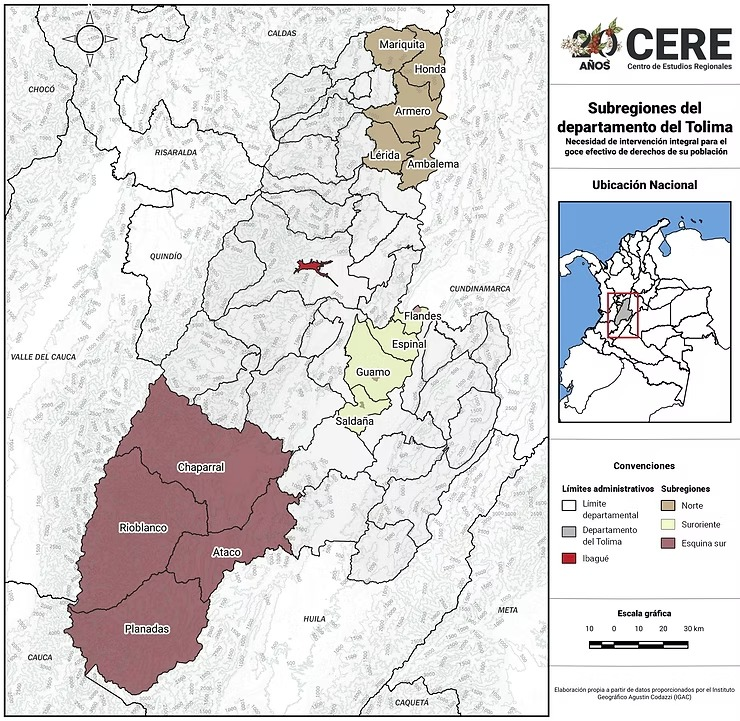

### Retos para el cuatrenio 2023 - 2027.

Pasaron las elecciones y como novedad, el departamento eligió no solo a la primera gobernadora en su historia, sino que votó masivamente por ella. Adriana Magali Matiz obtuvo 352 mil votos, 134 mil más que su antecesor, y ganó en todos los 47 municipios del departamento. 

Como lo que viene es la conformación de un comité de empalme representativo y técnico, y la definición de las líneas gruesas del nuevo Plan de Desarrollo Territorial, desde el Centro de Estudios Regionales de la Universidad del Tolima, consideramos que la nueva hoja de ruta institucional debe planear y presupuestar la intervención gubernamental de, por lo menos, cinco grandes problemas del Tolima para el periodo 2024 - 2027.

Estos problemas tienen que ver con **la planeación y el ordenamiento territorial, el fortalecimiento institucional y la distribución equitativa de los recursos públicos, el desarrollo económico inclusivo, las pobrezas y las desigualdades, y finalmente, la seguridad, la (precaria) respuesta institucional y la construcción de paz.**

En lo sucesivo, esta Nota Regional CERE desarrolla brevemente cada uno de estos asuntos.

#### **1. La planeación y el ordenamiento territorial.**

En el “Documento de directrices y lineamientos para el ordenamiento territorial departamental” (2023) que se convertirá en ordenanza este año, se identifican varios problemas que deben atenderse urgentemente.

En la dimensión ambiental, se presentan tensiones por la ampliación de la frontera agrícola sobre la Estructura Ecológica Adaptativa (EEA) del departamento, que integra todas las áreas protegidas, los ecosistemas estratégicos y otras zonas de conservación. **Las principales afectaciones se desarrollan sobre el área del Parque Nacional Natural los Nevados** (Desde Herveo hasta Ibagué) **y en el ecosistema de bosque seco tropical** (especialmente en Coyaima, Natagaima y Purificación), **el cual, ni siquiera cuenta con plan de manejo ambiental**

La gobernación, en conjunto con Cortolima, deben presupuestar la compra de propiedades privadas cuya actividad económica ponga en riesgo la EEA, así como la promoción del esquema de pagos por servicios ambientales, entre otras estrategias de conservación. En total, **el Tolima cuenta con más de 470 mil hectáreas en áreas protegidas, esto es, al rededor del 19% del área del departamento.**

Por otra parte, el otorgamiento de títulos mineros y de bloques de hidrocarburos, y la actividad del volcán Nevado del Ruíz, también constituyen tensiones sobre nuestra EEA. Sobre este último aspecto y un elemento relacionado como la amenaza por remoción en masa, **se debe promover la actualización de los Esquemas de Ordenamiento Territorial de los municipios sobre el área de influencia del volcán**, y asegurarse de que cuenten con condiciones para implementar sus planes de contingencia y de gestión de riesgo.

Por último, el Índice de Vulnerabilidad al Desabastecimiento Hídrico (IVH), revela que que seis subzonas hidrográficas tienen una alta fragilidad para mantener la oferta hídrica. **Entre estas se encuentran los ríos Lagunilla, Luisa, Sumapaz, Prado, Chenche y otros directos al Magdalena**, lo que significa que estos afluentes presentan un alto riesgo de desabastecimiento, y una capacidad de regulación y retención hídrica muy baja. Esto genera dos alarmas, de cara al Fenómeno del Niño: 

La primera, para la producción de comida a lo largo de toda la franja oriental del departamento, desde Honda hasta Natagaima; y la segunda, para los acueductos municipales. De acuerdo con los datos del Documento de directrices y lineamientos (…), **el 74% de la población del departamento no accede a agua potable, información que confirma el DANE, a través del Índice de Pobreza Multidimensional.**

Finalmente, otros tres asuntos ambientales y funcionales y que nos deben obligar al cumplir la tarea de ordenamiento este cuatrenio:

Primero, **el 82.98% de los municipios presentan déficit de alcantarillado, especialmente en zonas rurales; segundo, el 47% de los asentamientos del departamento (cabeceras, centros poblados, etc) presentan interferencias o solapamiento con el área reglamentaria de sus Plantas de Tratamiento de Aguas Residuales (PTAR); y tercero, la crisis de las escombreras y los rellenos sanitarios: el 70% de los municipios no implementa su Plan de Gestión Integral de Residuos Sólidos (PGIR).**

#### **2. El fortalecimiento institucional y la distribución equitativa de los recursos públicos.**

El ejercicio de la planeación en el departamento es débil y su filosofía, para la toma de decisiones, no ha logrado consenso entre los operadores políticos. Contrario a ello, son las dinámicas electorales y políticas, más que los criterios técnicos, lo que guía tanto la intervención de gobierno como la ejecución presupuestal.

En parte, es el desprecio por la planeación lo que explica que, desde el punto de vista de la solución de los problemas, la gobernación sea poco eficiente y eficaz. **Dos mediciones del Departamento Nacional de Planeación confirman eso: la de desempeño territorial (MDM-MDD), que deja al departamento en la cola de la zona Andina, y la de eficacia, que para la vigencia 2022, lo ubicó en rango bajo (50,2%).**

. Esto se explica por los importantes recursos presupuestales y técnicos con que cuenta la gobernación del Tolima, distinto al caso de los municipios, especialmente los más pequeños.  Una de las tareas urgentes en este sentido, es establecer un plan de trabajo para fortalecer los componentes de gestión y de resultados de las Entidades Territoriales del departamento.")

En nuestro ejercicio de medición desde el Centro de Estudios Regionales (2022), identificamos varios problemas. Lo primero es que no se cuenta con información rigurosa para establecer diagnósticos: ni poblacionales, ni sectoriales, ni territoriales. Para la muestra un botón: **la gobernación no tiene una caracterización de la población indígena**. Más allá de la información del Ministerio del Interior sobre cabildos y resguardos, desconoce el número de hogares, la ocupación de la población adulta, la situación de las mujeres, de los jóvenes y de los NNA, etc.

Desde el punto de vista programático, encontramos tres problemas gruesos: 1. metas desconectadas de instrumentos de planeación nacional, que provocan bajos impactos en la solución de problemas (por ejemplo, en materia de lucha contra la pobreza); 2. desatención de los instrumentos de planeación, las directrices de los entes de control y las recomendaciones del Consejo Territorial de Planeación (por ejemplo, en materia de implementación del Acuerdo de Paz); 3. Metas bien orientadas pero con bajos niveles de ejecución (el caso de los temas ambientales). 

Finalmente, en lo relativo a la ejecución presupuestal, varias cosas: 1. el gasto del departamento se concentra prácticamente en Ibagué y en otros pocos municipios. De hecho, algunos territorios concentran varias fuentes de recursos, como los del Sistema General de Regalías, los provenientes de Ingresos Corrientes de Libre Destinación (ICLD), y los del empréstito que gestionó el gobernador Orozco. 2. mientras que algunos municipios concentran el gasto, otros permanecen en un apartheid institucional: no recaudan, no tienen capacidad de gestión y no reciben recursos del departamento.

#### 3. El desarrollo económico inclusivo.

Instituciones políticas débiles, mala planeación y la tarea del ordenamiento territorial incumplida, explican, en parte, el rezago económico del departamento. El perfil publicado por el Ministerio de Comercio, Industria y Turismo en julio, presenta dos datos clave: primero, el escaso crecimiento del PIB respecto del promedio nacional (tres puntos por debajo); y segundo, el nivel de desocupación: Tolima es segundo en la tasa de desempleo por departamentos a nivel nacional, con el 15,7 %, tan solo detrás del departamento del Cesar.

. Variación anual del PIB. Figura 2 (der). Composición sectorial del PIB. Abajo. Figura 3 (izq). Evolución del puntaje y ranking Índice Departamental de Competitividad. Figura 4 (der). Evolución del puntaje y ranking Índice Departamental de Innovación.")

En los índices de innovación y de competitividad también se evidencia ese rezago, lo cual arroja preguntas sobre las importantes diferencias entre el discurso político y la realidad del departamento. Descontando la “fórmula mágica” de la exención tributaria, el nuevo Plan de Desarrollo debe considerar tres escenario clave para impulsar el desarrollo económico:

**1. las infraestructuras para la conectividad, entendidas en su doble acepción:** como vías (terciarias y secundarias) y las TIC. En el primer caso, dado que los kilómetros de carreteras para intervenir son incontables y los recursos escasos, un buen criterio de priorización se puede establecer a partir de un análisis de la productividad regional.

**2. Mayor inversión en ciencia, tecnología e innovación, pero también, estrategias de seguimiento y evaluación de los recursos ya invertidos:** ¿Cuál es el impacto de estos proyectos en las cadenas productivas? ¿Por qué nos mantenemos rezagados pese a las inversiones en este campo? De otro lado, la concurrencia - en plata blanca - del sector privado es fundamental. La inversión en CTI y en TIC, son determinantes en los índices de innovación y competitividad.

Bastas zonas del departamento desconectadas de las zonas wifi, sin vías de acceso y en donde no llega ni siquiera la señal de celular, ¿Qué tan competitivas pueden llegar a ser?

**3. Mayor y mejor inclusión productiva.** Esto tiene que ver con que las personas que superan la pobreza monetaria puedan acceder a puestos de trabajo de calidad o a oportunidades económicas que les garanticen fuentes de ingreso suficientes y sostenibles. Naciones Unidas publicó un informe recientemente, por medio del cual propuso criterios de medición y un marco de política aplicable para el caso colombiano.

Aunque todavía no contamos con datos subnacionales, los resultados para Colombia son muy preocupantes. Para el 2021, el 70,9% de la población mayor de 18 años estaba en exclusión productiva, el doble de la población en pobreza monetaria, lo cual sugiere que la agenda de la inclusión productiva es exigente en tanto que implica, básicamente, la garantía de trayectorias de salida de la pobreza sostenibles. Los jóvenes y las mujeres (indígenas y no indígenas), son las poblaciones a priorizar.

Por último, la **“reactivación económica”** del campo, no tiene que ver ferias de servicios ni entregas de abonos y huertas caseras, sino con la formalización de la propiedad de la tierra, la adjudicación de predios y el crédito agropecuario. Para avanzar en esa dirección, el nuevo PDT debe adoptar la Ordenanza 0014 del 29 de diciembre de 2019, la cual establece los lineamientos para la implementación del Plan Ordenamiento Social y Productivo de la Propiedad Rural del departamento.

Mientras que el Huila es reconocido a nivel nacional por el ordenamiento productivo del territorio y el diseño una hoja de ruta consistente para la formalización de la propiedad rural, en el Tolima, el POSPPR fue engabetado y la meta de formalización de predios se le entregó a la cooperación internacional, que logró avanzar, con dificultades, en apenas dos municipios del departamento durante este cuatrenio.

#### **4. Las pobrezas y las desigualdades.**
Las mediciones de pobreza son estables y conocidas (Conpes 150 de 2012), pero poco o nada se hace desde el nivel territorial para comprenderlas. Básicamente, se trata de la caracterización de los ingresos por hogar, para el caso de la pobreza monetaria, y de la medición a través de variables como acceso a educación, agua potable, formalización laboral y condiciones de habitabilidad, para el caso de la pobreza multidimensional.

Esta última es una buena medida, además, para determinar brechas de desigualdad, especialmente entre hogares y personas que habitan zonas rurales dispersas (o no tan dispersas), y centros poblados y cascos urbanos. 

El Tolima ha tenido variaciones leves en las mediciones de pobreza monetaria y multidimensional que, a lo largo de una década, mantienen al departamento por encima del promedio nacional, casi exactamente en la dirección contraria a la del PIB: **crecemos menos desde el punto de vista económico y somos más pobres. Aunque buena parte de la política de mitigación de la pobreza recae sobre la nación, los departamentos concurren en varios escenarios, especialmente si se comprenden estas cifras de manera desagregada y en clave territorial y poblacional.**

")

**¿Cuáles son las tareas del departamento en ese escenario?** Por lo menos tres: 1. el de los diagnósticos consistentes (en clave poblacional y territorial), 2. el de la articulación interinstitucional eficiente (con gobierno nacional, pero también, con las alcaldías), y 3. el de las inversiones inteligentes, por ejemplo, para disminuir las brechas de desigualdad y promover la inclusión productiva.

**¿Qué significa disminuir las brechas de desigualdad y cómo estas brechas se relacionan con las pobrezas (monetaria y multidimensional)?** [Desde el CERE elaboramos varias recomendaciones sobre los retos de la equidad en el Tolima](http://administrativos.ut.edu.co/images/VICEACADEMICA/CERE/publicaciones/Boletines_an%C3%A1lisis_regional/1._Boletin.pdf), que abordan dos grandes dimensiones de las políticas públicas:

**La dimensión territorial**, o el enfoque territorial, que exige que las intervenciones de la Entidad Territorial comprenda la realidad de los centros poblados y zonas rurales, en donde el desarrollo de capacidades (a través de la educación), el acceso a servicios públicos y en general, las condiciones de vida, son altamente precarias.

**La dimensión poblacional**, o el enfoque poblacional, que debe atender dos asuntos: la equidad de género, que incumbe particularmente a las mujeres y sus particularidades derivado de los roles atribuidos en las relaciones sociales y en el ámbito “privado”, así como a la población LGBTIQ+; y el enfoque étnico, particularmente asociado a la población indígena, la cual, como señalé arriba, carece de una caracterización rigurosa que oriente la intervención de la gobernación a través de políticas públicas inclusivas.

#### **5. La seguridad, la (precaria) respuesta institucional y la construcción de paz**

Son tres asuntos gruesos, y no tiene que ver solamente con “los malos”, sino con la ausencia de una política de seguridad multidimensional basada en evidencia y de un liderazgo capaz de articular a todos los actores institucionales, cuyo objetivo, más que capitalizar políticamente los problemas de orden público, se centre en la protección de la población civil.

**1. Las amenazas a la seguridad responden a dos contextos distintos:** el del crimen organizado y su diverso abanico de actividades delictivas, y el escenario de reconfiguración de la violencia armada, particularmente por disidencias de las antiguas FARC. En términos espaciales, podemos hablar de dos escenarios de violencia instrumental: el de la criminalidad pura y dura en las cabeceras municipales - incluida Ibagué -, y el del “nuevo” conflicto armado en las zonas rurales del sur del departamento.

[La Defensoría del Pueblo](https://alertastempranas.defensoria.gov.co/) viene alertando sobre estos dos escenarios desde el año pasado. En la AT 002 de 2023, advirtió sobre la situación de riesgo en cinco municipios del norte del departamento: Honda, Mariquita, Armero Guayabal, Ambalema y Lérida; y en la AT 016 de 2022, hizo lo propio en los cuatro municipios PDET del sur del Tolima: Planadas, Ataco, Chaparral y Rioblanco, lo que significa, ni más ni menos, el deterioro del dividendo de paz legado del Acuerdo con la antigua guerrilla de las FARC.

Lo elemental, es que el nuevo Plan de Desarrollo incorpore las recomendaciones de la Defensoría. 

En particular, sobre el deterioro progresivo de la seguridad, la paz y los derechos humanos en el sur del Tolima, desde el Centro de Estudios Regionales hemos realizado varios informes que dejan ver, no solamente la avanzada de grupos disidentes del Acuerdo de Paz, sino la precaria respuesta institucional desde el punto de vista de la protección de la población.

**2. La precaria respuesta institucional, en términos de justicia y de protección de la población civil.** No se trata solamente de “lo que hacen los malos”, sino de cómo responde la institucionalidad a los desafíos que impone su accionar delictivo. En este aspecto, desde el CERE hemos evidenciado una completa desarticulación de las instituciones concernidas en la prevención y la protección de la población.

El contraste entre denuncias, capturas, imputaciones y sentencias condenatorias/sancionatorias deja ver el altísimo nivel de impunidad de los delitos que afectan al departamento (la cifra a nivel nacional está por encima del 90%). **Reducir la impunidad y mejorar la satisfacción de la ciudadanía con la justicia, deben estar en el centro de una política eficiente de seguridad y de convivencia** (un asunto que poco se menciona en el debate público).

Más allá de responsabilizar la política de paz del gobierno nacional por la inseguridad en el departamento, la gobernadora debe ocuparse de varios asuntos urgentes: **el liderazgo del sector, la articulación interinstitucional para la prevención y la protección, la participación de la sociedad civil, la generación de confianza en las autoridades** (y de las autoridades entre sí), **y la inversión en tecnología, columna vertebral de una política de seguridad y convivencia moderna.**

En lo relativo a la mejora de los planes de contingencia y de prevención y protección (P&P) municipales y departamental, desde el CERE identificamos varias fallas se pueden resumir en los siguientes tres puntos centrales: i. el diseño y aprobación de los planes y rutas de P&P departamentales y municipales no cuenta con participación de la población civil; ii. la falta de capacidades - y en algunos casos - de voluntad política de quienes se ocupan de su implementación; y iii. la desarticulación interinstitucional (nación-departamento-municipio), que desemboca en barreras institucionales para el acceso a los mecanismos de protección y la desconfianza de la población.

**3. La indiferencia sistemática con la implementación del Acuerdo Final de Paz (AFP):** la transparencia de las instituciones responsables del registro y seguimiento de casos, el despliegue institucional para garantizar la seguridad y las iniciativas de política pública, así como la implementación del Acuerdo de Paz, deben contar con la articulación entre las autoridades civiles y militares, no exclusivamente para hacer frente a los escenarios de violencia y criminalidad, sino también para constituir mecanismos y herramientas de diligenciamiento, registro y seguimiento de casos, y también, para llenar de contenido las iniciativas comunitarias de construcción de paz.

El PDT vigente no alcanzó a articular ni el 2% de los compromisos concretos del AFP, pese a la fragilidad de la paz en el departamento. Elementos fundamentales como la formalización de la propiedad rural, la implementación del Programa de Desarrollo con Enfoque Territorial, PDET, en el sur del Tolima; la reincoporación de los firmantes de paz y la reparación de la víctimas, quedaron por fuera de la planeación departamental.

Preocupa que, en esa misma línea, el programa gobierno de la gobernadora electa deje de lado las iniciativas antes mencionadas, con un agravante: el deterioro del dividendo de paz en el sur del Tolima, que se explica precisamente por el abandono de los ejes centrales del Acuerdo. 

**Son cuatro escenarios gruesos de la paz en el sur del Tolima:**

**1. El de las tierras y el desarrollo rural, contenido especialmente en el punto 1 del AFP.** Esto es: la articulación para la implementación de las iniciativas del Plan de Acción para la Transformación Regional (PATR) y la Hoja de Ruta PDET para el sur del Tolima; el avance de la formalización y la adjudicación de predios a partir de los Planes de Ordenamiento Social de la Propiedad Rural y del catastro multipropósito en los municipios. Básicamente, el diálogo con dos agencias: la de renovación del territorio (ART), y la de tierras (ANT), ambas con coordinaciones territoriales en Tolima.

**2. La reincorporación y las garantías de protección para el ejercicio del liderazgo social, contenidos en los puntos 1 y 2 del AFP.** Esto es: la concurrencia en las acciones para la reincorporación económica y comunitaria de las y los firmantes de paz, ubicados en AETCR y NAR en todo el departamento; y el fortalecimiento de la instancia comunitaria de autoprotección recientemente creada en la subregión PDET, con el apoyo de la Universidad del Tolima y de CODHES. La articulación con la Agencia de Reincorporación Nacional, la Misión de Verificación de Naciones Unidas y la UT, es clave en este aspecto.

**3. Los planes territoriales de drogas, contenidos en el punto 4 del AFP.** El nuevo PDT cuenta con dos insumos muy importantes para avanzar en esta perspectiva: i. La Política Nacional de Drogas del alto gobierno, la cual desarrolla el tema de drogas del Acuerdo de Paz; y ii. el diseño del estudio de consumo de sustancias psicoactivas que adelantó la Secretaría de Salud del departamento, que debe llevarse a cabo en el nuevo cuatrenio.

**4. La reparación de las víctimas, prevista en el punto 5 del AFP.** Esto es, básicamente, dos asuntos: i. la identificación y apoyo a la implementación de los Planes Integrales de Reparación Colectiva del Tolima (Valle de San Juan, Ataco y sus siete veredas, SRC étnico de Ataco, Chaparral LGBTI Diversa y pueblo Nasa de Gaitania), y ii. el apoyo a los enlaces territoriales de la Jurisdicción Especial para la Paz en lo relativo al desarrollo de los Trabajos, Obras y Acciones con sentido Reparador y Restaurador (TOAR), que se desprenderán de las sanciones propias del Tribunal de Paz.

#### 6. Referencias

&nbsp;&nbsp;&nbsp;&nbsp;*Centro de Estudios Regionales (2023). Elementos políticos, institucionales y territoriales asociados al riesgo para el liderazgo social en el sur del Tolima. Documento electrónico. Consultado en noviembre de 2023.*

&nbsp;&nbsp;&nbsp;&nbsp;*(2022). Planear para transformar. Aproximación a los resultados de la ejecución del Plan de Desarrollo Territorial “El Tolima nos Une” (2020 - 2023). Informe de Investigación CERE 10. Universidad del Tolima.*

&nbsp;&nbsp;&nbsp;&nbsp;*Centro de Estudios Regionales, Asopep (2021). Dinámicas de riesgo para NNA en el sur del Tolima. Los nuevos escenarios del reclutamiento forzado, el uso y la utilización de menores”.  Informe de Investigación CERE 10. Universidad del Tolima.*

&nbsp;&nbsp;&nbsp;&nbsp;*Centro de Estudios Regionales (2020). Nuevas y viejas violencias. Desafíos para la no repetición del conflicto armado en el sur del Tolima. Informe de Investigación CERE 2. Universidad del Tolima.*

&nbsp;&nbsp;&nbsp;&nbsp;*(2020). Desafíos de equidad frente a la pandemia COVID-19. Recomendaciones para el departamento del Tolima. Boletín de Análisis Regionales CERE 1. Universidad del Tolima.*

&nbsp;&nbsp;&nbsp;&nbsp;*Defensoría del Pueblo (2023). Alerta Temprana 002 de 2023. Documento electrónico. Consultado en noviembre de 2023.*

&nbsp;&nbsp;&nbsp;&nbsp;*(2022). Alerta Temprana 016 de 2022. Documento electrónico. Consultado en noviembre de 2023.*

&nbsp;&nbsp;&nbsp;&nbsp;*Departamento Nacional de Planeación (2023). Medición de Eficacia por departamentos. Documento electrónico. Consultado en noviembre de 2023.*

&nbsp;&nbsp;&nbsp;&nbsp;*(2023). Medición de Desempeño Departamental. Documento electrónico. Consultado en noviembre de 2023.*

&nbsp;&nbsp;&nbsp;&nbsp;*(2023). Medición de Desempeño Municipal. Documento electrónico. Consultado en noviembre de 2023.*

&nbsp;&nbsp;&nbsp;&nbsp;*Ministerio de Comercio, Industria y Turismo (2023). Perfiles económicos departamentales. Documento electrónico. Consultado en noviembre de 2023.*

&nbsp;&nbsp;&nbsp;&nbsp;*Secretaría de Planeación y TICS (2023). Documento de directrices y lineamientos para el ordenamiento territorial departamental. Gobernación del Tolima (Segunda versión).*

